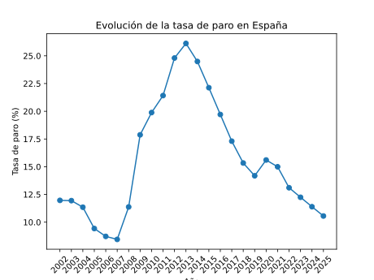

# 📊 Análisis del paro en España con Python

## 📌 Descripción del proyecto

Proyecto de **análisis exploratorio de datos** utilizando datasets públicos del **Instituto Nacional de Estadística (INE)**.

El objetivo de este proyecto es mostrar, de forma práctica, cómo utilizar **Python y librerías de análisis de datos** para analizar la evolución de la tasa de paro en España.

Este análisis forma parte del proyecto educativo **InformaticaData España**, orientado a aprender análisis de datos utilizando datasets reales.

---

## 📁 Estructura del proyecto

```
analisis-paro-espana
│
├── data
│   └── paro_2002_2025.csv
│
├── notebooks
│   └── analisis.ipynb
│
├── images
│   └── evolucion_paro_espana.png
│
├── requirements.txt
└── README.md
```

* **data/** → Dataset utilizado en el análisis
* **notebooks/** → Notebook con el análisis completo
* **images/** → Visualizaciones generadas
* **requirements.txt** → Dependencias del proyecto

---

## 📚 Dataset

Los datos utilizados proceden del **Instituto Nacional de Estadística (INE)** y contienen información sobre la **tasa de paro en España por periodos trimestrales**.

El dataset incluye variables como:

* Periodo
* Provincia
* Tipo de tasa
* Valor de la tasa de paro

En este análisis se utiliza el **Total Nacional** para estudiar la evolución temporal.

---

## 🧰 Tecnologías utilizadas

* Python
* Pandas
* Matplotlib
* Jupyter Notebook

Estas herramientas permiten realizar procesos completos de análisis de datos:

* Carga de datos
* Limpieza de datos
* Transformación
* Visualización

---

## 📈 Resultado del análisis

El análisis permite visualizar la evolución anual de la tasa de paro en España.



Entre los aspectos más relevantes se pueden observar:

* Incremento exponencial del paro durante la crisis económica de 2008.
* Máximo alrededor de 2013.
* Descenso progresivo en años posteriores sin llegar a recuperar los valores previos a la crisis.
* Impacto visible durante el periodo de la pandemia.

---

## 🚀 Cómo ejecutar el proyecto

1. Clonar el repositorio

```
git clone https://github.com/InformaticaData/analisis-paro-espana 
```

2. Acceder a la carpeta del proyecto

```
cd analisis-paro-espana
```

3. Crear un entorno virtual

```
python -m venv venv
```

4. Activar el entorno

Mac / Linux

```
source venv/bin/activate
```

Windows

```
venv\Scripts\activate
```

5. Instalar dependencias

```
pip install -r requirements.txt
```

6. Abrir el notebook

```
notebooks/analisis.ipynb
```

---

## 🌐 Artículo del blog

Este análisis se explica paso a paso en el artículo publicado en:

**InformaticaData España**

https://informaticadata.es/analisis-del-paro-en-espana-con-python/

---

## 👨‍💻 Autor

**Carlos Hernández**

Docente de Informática y Analista de Datos.

Proyecto educativo:

**InformaticaData España**

Aprende análisis de datos con datasets reales utilizando Python.

---
